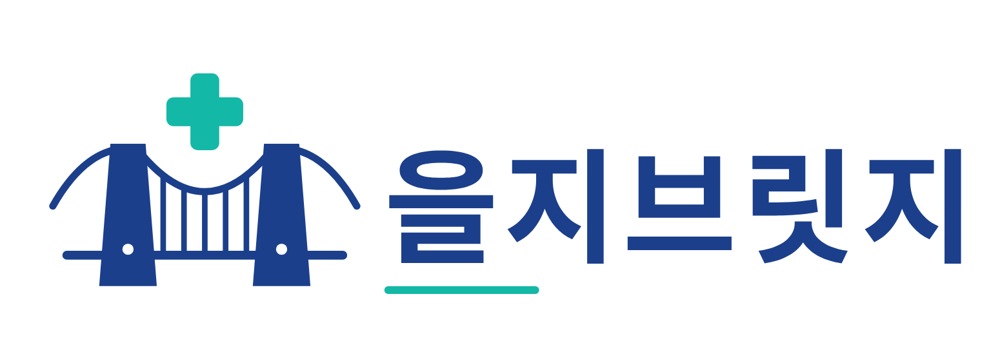
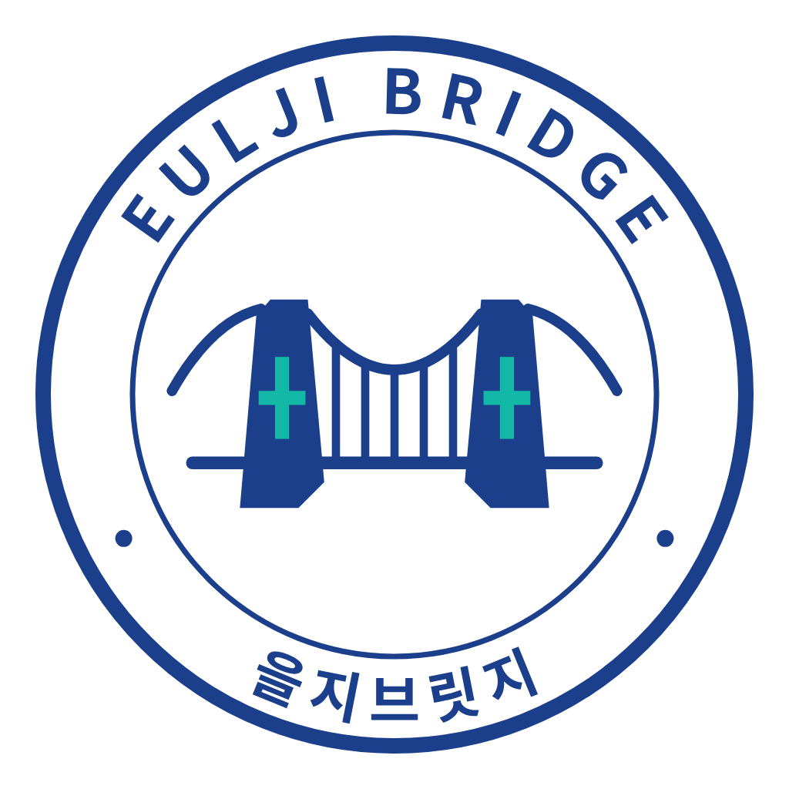

<div align="center">



<br/>

### 재학 · 휴학 · 졸업, 신분이 바뀌어도 관계는 끊기지 않는 을지대학교 전용 커뮤니티

**멋쟁이사자처럼 을지대학교 14기 단체 프로젝트**

<br/>

[](https://github.com/orgs/EuljiBridge/projects/1)
[](https://github.com/EuljiBridge/PM/blob/main/docs/pm/02_프로젝트_운영계획.md)
[](https://github.com/EuljiBridge/PM/blob/main/docs/pm/01_조직_및_역할명세.md)

</div>

<br/>

## 을지브릿지란

을지대학교 재학생·휴학생·졸업생을 잇는 통합 커뮤니티 플랫폼입니다. 기존 대학 커뮤니티(에브리타임 등)는 **재학생만**을 전제로 설계되어, 휴학·졸업과 함께 선후배 관계가 끊깁니다. 을지브릿지는 **졸업생 멘토 ↔ 재학·휴학생**을 직접 연결하는 멘토링을 핵심 기능으로, 세 신분이 단절 없이 가치를 주고받는 구조를 만듭니다.

> 검증할 단 하나의 가설 — **"졸업한 선배와 재학 중인 후배를, 서비스를 통해 실제로 연결할 수 있는가?"**

<br/>

## 📍 지금 상황 <sub>(2026-10-06 기준)</sub>

| | |
|---|---|
| **현재 단계** | Phase 1-A — 기반·인증 스프린트 (S1 착수) |
| **개발 착수** | 2026-10-06 (착수) |
| **12/08 MVP까지** | **D-63** |
| **연합 해커톤(간지톤)** | 10/20 ~ 11/20 — 개발 최대한 중지, 멘토 섭외 집중 |
| **실가용 개발 기간** | 4.6주 (간지톤 제외) |
| **개발 방식** | 반응형 웹 (Next.js) 우선 · 모바일 앱은 확장 단계에서 검토 |

진행 상황은 → **[Project 보드](https://github.com/orgs/EuljiBridge/projects/1)** 에서 실시간으로 확인하세요.

<br/>

## 📂 레포지토리

| 레포 | 설명 | 스택 |
|---|---|:---:|
| **[PM](https://github.com/EuljiBridge/PM)** | 기획·운영 문서 — **여기서부터 시작하세요** | Markdown |
| **[eulji-bridge-server](https://github.com/EuljiBridge/eulji-bridge-server)** | 백엔드 API 서버 | Spring Boot · MySQL 8.0 |
| **[eulji-bridge-app](https://github.com/EuljiBridge/eulji-bridge-app)** | 모바일 앱 (확장 단계) | React Native (Expo) |
| **[eulji-bridge-web](https://github.com/EuljiBridge/eulji-bridge-web)** | 사용자 웹 · 관리자 백오피스 | React · Next.js |

<br/>

## 📖 핵심 문서

처음이라면 [`PM/docs/pm/00_문서맵.md`](https://github.com/EuljiBridge/PM/blob/main/docs/pm/00_문서맵.md) 부터 읽으세요.

| 문서 | 내용 |
|---|---|
| [사업기획서](https://github.com/EuljiBridge/PM/blob/main/docs/을지브릿지_사업기획서.md) | 왜 만드는가 — 문제 정의·시장·비즈니스 모델 |
| [01. 조직·역할](https://github.com/EuljiBridge/PM/blob/main/docs/pm/01_조직_및_역할명세.md) | 24명 조직도, 직책별 역할, 의사결정 규칙 |
| [02. 운영계획](https://github.com/EuljiBridge/PM/blob/main/docs/pm/02_프로젝트_운영계획.md) | 스프린트·Git 규칙·DoD·일정 |
| [03. 기능명세](https://github.com/EuljiBridge/PM/blob/main/docs/pm/03_기능명세_마스터.md) | 12/08 MVP 범위(27종), 전체 기능 69종 |
| [08. API 계약](https://github.com/EuljiBridge/PM/blob/main/docs/pm/08_API_계약.md) | FE ↔ BE 인터페이스 |
| [09. 아기사자 가이드](https://github.com/EuljiBridge/PM/blob/main/docs/pm/09_아기사자_온보딩_가이드.md) | 처음 참여하는 팀원용 |
| [11. 개인별 일정표](https://github.com/EuljiBridge/PM/blob/main/docs/pm/11_개인별_작업일정표.md) | 24명 전원 주차별 캘린더 |

<br/>

## 👥 팀 구성

```
메인 PM 1 · 서브 PM 1
├─ 프론트엔드   6명   React · Next.js (반응형 웹)
├─ 백엔드      11명   Spring Boot 3 · 5개 파드
└─ 디자인       6명   Figma
```

운영진이 **사수**로서 **아기사자**(부원)의 개발을 지도하는 멘토링 구조로 진행합니다. 자세한 역할 정의는 [01번 문서](https://github.com/EuljiBridge/PM/blob/main/docs/pm/01_조직_및_역할명세.md)를 참고하세요.

<br/>

## 🛠 기술 스택

<div align="center">


</div>

<br/>

<div align="center">


<sub>을지대학교 멋쟁이사자처럼 14기 · Eulji Bridge</sub>
</div>
